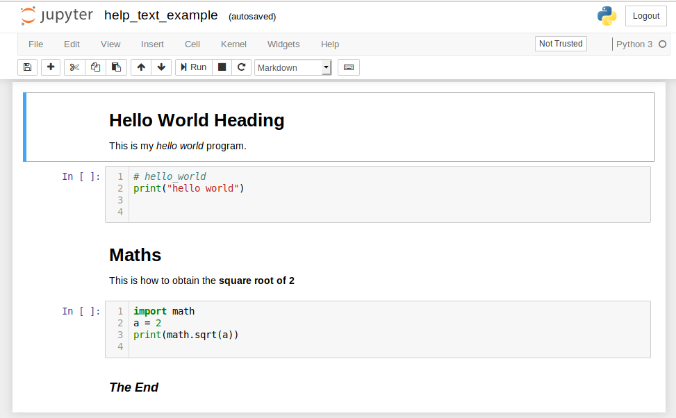

# ipynb-extractor

## Introduction

**ipynb extractor** is a python program designed to:

1. Read a Jupyter notebook *.ipynb* file using pythons simplejson module.

2. Create a folder based on the file name of the Jupyter notebook file.

3. From the json data extract the **markdown** and **code** cells.

4. Extract to the folder the code cells as python *.py* files or as markdown *.md* files.


## Installation

On the Linux platform the python program *ipynb-extractor.py* may be copied to `/usr/local/bin/` as *ipynb-extractor*. Then change the file to be executable with `sudo chmod +x /usr/loca/bin/ipynb-extractor`.

Use `cd` to change your default directory to be where your ipynb file(s) are located that you wish to extract their markdown and code contents. 

## Help

The programs help summary may be obtained with `$ python3 ipynb-extractor.py -h` while the full help information with examples is obtained with `$ python3 ipynb-extractor.py --help`. For example:

```
$ python3 ipynb-extractor.py -h

ipynb-extractor version: 0.1

Read a Jupyter notebook (.ipynb) file and extract to a folder 
the markdown and code cells as markdown.md and python.py files.

Usage: ipynb-extractor [OPTION]... [FILE]...

From Jupyter notebook ipynb file(s) extract the markdown and code cells.
Create a folder based on the ipynb filename. Extract to the folder the
code cells as python (.py) files or as markdown (.md) files.


[OPTION]...
Options and arguments:
   -h       print this brief help message and exit. 
   --help   print a full help message and exit.

[FILE]...
If no files are provided as arguments then the program will run in a menu 
driven mode and prompt you to select a Jupyter notebook (.ipynb) file.

Any file with a .ipynb extension in the current working directory may be 
provided as an argument. A folder is created based on the ipynb file name.

A list of space separated files may be provided. One folder will be created 
for each ipynb file.

The files may be selected by wild-carding with *, or *.ipynb. E.g.
$ ipynb_creator *.ipynb

```

## Notes / Example:

If the current working directory already has a folder with the ipynb file, 
prompting is performed to determine if you wish to over-write the folder.

The ipynb_creator utility provides an example of reading a text file and
creating an ipynb file. Jupyter notebook renders the ipynb file like this:




The ipynb-extractor utility may be used on this ipynb file. For example:

```
$ python3 ipynb-extractor.py help_text_example.ipynb

ipynb-extractor version: 0.1

Read a Jupyter notebook (.ipynb) file and extract to a folder 
the markdown and code cells as markdown.md and python.py files.

Created folder `help_text_example`.
ipynb file: help_text_example.ipynb, total cells: 5
ipynb file: `help_text_example.ipynb` cells extracted to folder `help_text_example`
Markdown files: 3, Python files: 2
```

The folder help_text_example has been created and the contents of the folder is as follows:
```
$ ls -1 help_text_example/
help_text_example_01.md
help_text_example_02.py
help_text_example_03.md
help_text_example_04.py
help_text_example_05.md
```
If we examine one of the files then we see that it contains the python code that was in the Jupyter notebook cell:

```
$ cat help_text_example/help_text_example_04.py
import math
a = 2
print(math.sqrt(a))
```

Author: Ian Stewart - 9 August 2019.


